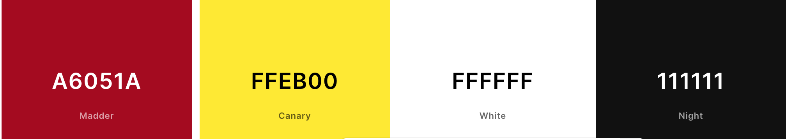

# F1 Quizz - The general quiz about formula 1

# Overview
- F1 Quizz is a fun challenging formula 1 quiz that challenges the knowledge of the user regarding formula 1. The site is aimed at formula 1 fans who are aiming to test their general knowldedge of formula 1.

- The link to the deployed sit is attached below.

# Purpose of the site
- The purpose of the site is to attract existing formula 1 fans who would like to put their formula 1 knowledge to the test, as well as new fans who would like to learn a few intersting facts about F1. 

# UX Design
## User Stories 

### As a first time User 
- I want to see a unique design and consisten color scheme
- I want all the buttons to work seamlessly without isssues
- I want a responsive site that will work across all devices and all screens
- I want easy to follow instructions 
- I want to be able to see if I've answered a question correctly or incorrectly
- To be able to see a leaderboard features with the best scores

### As a returning user
- I want to be able to have the option to see the leaderboard and see who the best score is
- I want to be able to go back on the site with the question being randomised from the start
- I want for the site to be compatible and functional across all devices

### Color scheme
- For the color scheme, I deciced to emulate the color scheme of the ferrari formula 1 team, which happens 
to be statiscally, the most successful formula 1 team.

### Fonts used
-  The fonts used for the site was Montserrat, sans serif

# Wireframes 

# Features
## Landing Page

- The landing page, which consists of the main buttons Start, which will take you to the quizz page. The  instructions, which will take the user to the instruction page & leaderboard button that will take the user to the leaderboard page

## Main Quiz Page

- The page below which consists of the main quiz page which features a question counter and score count. The hover effect highlighted in the screenshot below, to help the user know which answer the cursor currently is pointing at.

## End of the quiz

- This section of the quiz is where the final score is displayed. users will be then prompted to input their username and then save it. The user will also be prompted to either start the quiz over should they wish to do so, or to go back to the homepage

## Leaderboard page

- This page shows the user the top 6 people in the leaderboard. The leaderboard is stored locally
- The user has the option to either start the quiz over or be prompted to back to the homepage

## Correct Answer

- The answer button will be highlighted in green whenever the correct answer has been selected

## Incorrect Answer

- Opposite to the correct answer, the incorrect answer will be highlighted In red for when the incorrect answer has been selected

# Features left to implement

- A feature that could be implemented in the future would be a different set of difficulty level, ranging from easy, medium, hard, expert. This would make it more challenging and more fun for existing formula 1 fans and new formula 1 fans
- to the display the correct answer whenever the incorrect answer has been clicked 

# Technologies Used
- HTML5
- CSS
- Javascript 
- Git, github, Gitpod
- Google fonts
- balsamiq wireframes
- Am I responsive
