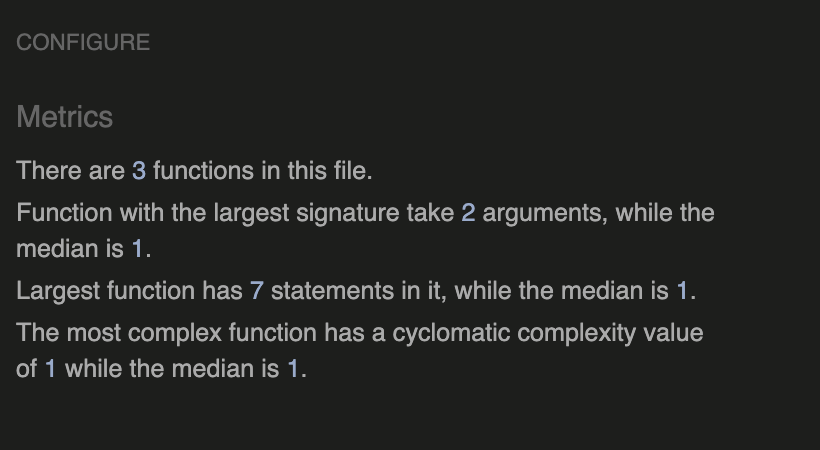
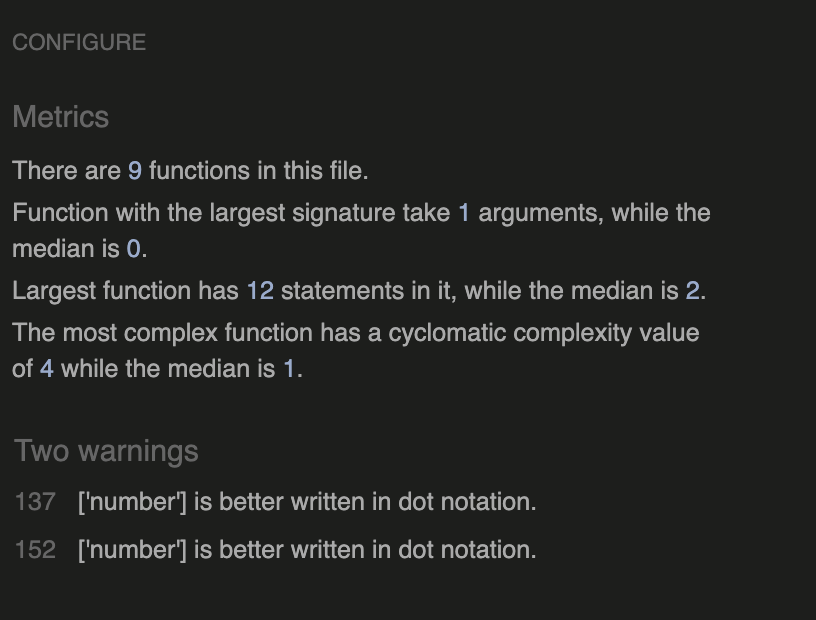

# F1 Quizz - The general quiz about formula 1

# Overview
- F1 Quizz is a fun challenging formula 1 quiz that challenges the knowledge of the user regarding formula 1. The site is aimed at formula 1 fans who are aiming to test their general knowldedge of formula 1.

- This is the link to the below site 

# Purpose of the site
- The purpose of the site is to attract existing formula 1 fans who would like to put their formula 1 knowledge to the test, as well as new fans who would like to learn a few intersting facts about F1. 

# UX Design
## User Stories 

### As a first time User 
- I want to see a unique design and consisten color scheme
- I want all the buttons to work seamlessly without isssues
- I want a responsive site that will work across all devices and all screens
- I want easy to follow instructions 
- I want to be able to see if I've answered a question correctly or incorrectly
- To be able to see a leaderboard features with the best scores

### As a returning user
- I want to be able to have the option to see the leaderboard and see who the best score is
- I want to be able to go back on the site with the question being randomised from the start
- I want for the site to be compatible and functional across all devices

### Color scheme
- For the color scheme, I deciced to emulate the color scheme of the ferrari formula 1 team, which happens 
to be statiscally, the most successful formula 1 team.

### Fonts used
-  The fonts used for the site was Montserrat, sans serif

# Wireframes 
## Landing page

## Quiz Page

## Enf of Quiz

## Leaderboard

# Features
## Landing Page

- The landing page, which consists of the main buttons Start, which will take you to the quizz page. The  instructions, which will take the user to the instruction page & leaderboard button that will take the user to the leaderboard page

## Instructions

- This page contains a brief overview and instructions on the quiz, how many questions there are and the maximum points available

## Main Quiz Page

- The page below which consists of the main quiz page which features a question counter and score count. The hover effect highlighted in the screenshot below, to help the user know which answer the cursor currently is pointing at.

## End of the quiz

- This section of the quiz is where the final score is displayed. users will be then prompted to input their username and then save it. The user will also be prompted to either start the quiz over should they wish to do so, or to go back to the homepage

## Leaderboard page

- This page shows the user the top 6 people in the leaderboard. The leaderboard is stored locally
- The user has the option to either start the quiz over or be prompted to back to the homepage

## Correct Answer

- The answer button will be highlighted in green whenever the correct answer has been selected

## Incorrect Answer

- Opposite to the correct answer, the incorrect answer will be highlighted In red for when the incorrect answer has been selected

# Features left to implement

- A feature that could be implemented in the future would be a different set of difficulty level, ranging from easy, medium, hard, expert. This would make it more challenging and more fun for existing formula 1 fans and new formula 1 fans
- to the display the correct answer whenever the incorrect answer has been clicked 
- A 15 second timer to answer each question.
- The use of image based questions to make the game more interesting/memorable

# Technologies Used
- HTML5
- CSS
- Javascript 
- Git, github, Gitpod
- Google fonts
- balsamiq wireframes
- Am I responsive

# Testing

- Browser testing was completed via Google chrome Dev Tools. For iPhone SE (375x667) and also larger screens 
- I tested it in various browsers such as Firefox, Chrome, Edge and Safari.
- I was able to confirm that the quiz was working as expected on every page and every outcome possible was working as intended to.

## Validator testing 

All of my HTML files were tested using the [HTMLValidator](https://validator.w3.org/nu/#textarea) and all passed with no errors. The screenshot below is the same message I got from all html files
- 

All of my CSS files were tested using the [CSSValidator](https://jigsaw.w3.org/css-validator/) and all passed with no errors. 
- 

My Js files were tested using the [JsHint](https://jshint.com/) and all passed, although some files had some warnings which did not have an impact on the overall functionality of the app.

End.js
 

Leaderboard.js
 

Quizz.js

## Lighthouse reporting

- I conducted the lighthouse report in google chrome to test the perfomance of the quiz site, results can be seen below

## Manual Testing

| Feature | Action  | Expectation  | Result  |
|---------|---------|--------------|---------|
| Starting a new game| Click on play now button  | Expects the user to be directed to quizz page | Pass |
| Display instructions | Click on instruction button | Expects user to be redirected to the instruction page | Pass |
| Display leaderboard | Click on leaderboard button | Expects user to be redirected to the leaderboard page | Pass  |
Correct Answer | clicking on anyone of the 4 option | Expects the correct answer choice to go green | Pass|
| Incorrect Answer | Clicking on anyone of the 4 option | Expects the incorrect answer to go red | Pass|
| Home button on quizz page | Click on Home button | The user should be redirected to the home screen | Pass |
| Restart button on quiz page | Click on Restart Button | the user should be redirected back to question 1 | Pass |
| Save button | Click on the save button | Once the user has filled the input with their name, the save button works | Pass |
| Start Over button at end of game | Click on the Start Over button | User redirected to the start of the quizz | Pass |
| Home Button at the end of game | Click on the Home Button | User gets redirected to the Home screen | Pass |

## Bugs

- While working on testing the app, I came across an issue when tring to save my highscore locally. Evertime the user input their name, it wouldn't register at all and the issue was that there was a mising quotation mark at the end of the class name 

# Deployment

The site has been deployed using [GitPages](https://pages.github.com)
+ In the GitHub repository, the seting tab.
+ Under General, go to 'navigate to Code and Automation, then click 'Pages'.
+ In the Build up and Deployment section for Source, Select 'Deploy from a branch' from the dropdown list.
+ For Branch, please select 'main' from the drop-down list, then click save
+ The link to the complete website will be displayed at the top of the page
+ The deployed site will be updated automatically upon new commits to the master branch.

# Credits

- For this project I relied a lot on the material from the likes of Brian Design and James Quick, the link to their tutorial can be found below.
* [BrianDesign](https://www.youtube.com/watch?v=f4fB9Xg2JEY)
* [JamesQuick](https://www.youtube.com/watch?v=IK257Ln0MZc)

- When I had an issue with removing text decorations from my anchor elements, It was thanks to the link below that I was able to overcome the issue
[anchortag](https://www.shecodes.io/athena/62460-how-to-remove-underline-from-an-html-link-with-css#:~:text=You%20need%20to%20set%20the,any%20of%20its%20other%20styles.&text=In%20this%20example%2C%20the%20a,any%20links%20on%20your%20website)

- [Fontawesome](https://fontawesome.com/search?q=end&o=r)

- webstite favicon was taking from here [flaticon](https://www.flaticon.com/style/search?word=formula+1)

- Coolors where the color theme for the site was picked from [Coolors](https://coolors.co/a6051a-ffeb00-ffffff-111111-ef3054)

- [W3Cvalidator](https://validator.w3.org/nu/#textarea)
